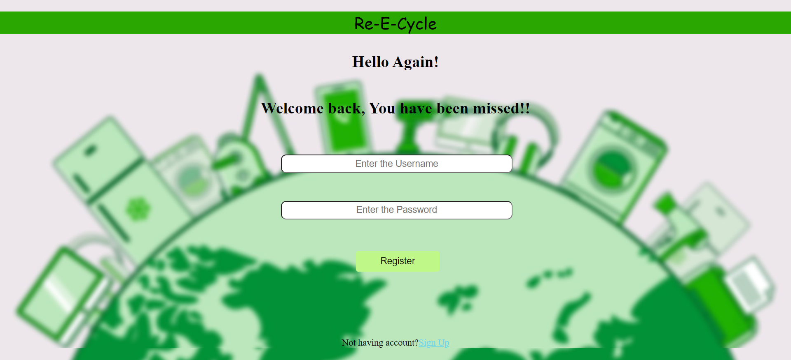
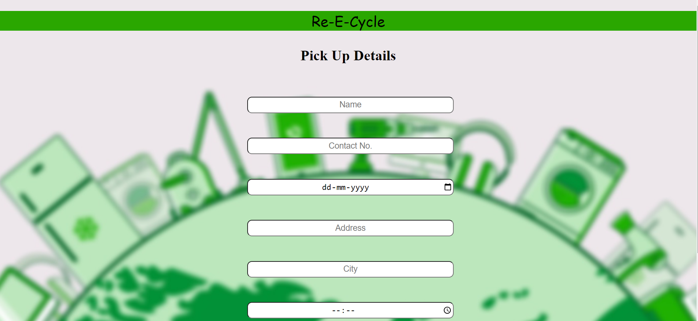

# Re-Cycle

EcoCycle is a sustainable initiative aimed at streamlining the collection and recycling of electronic waste. This open-source project provides a user-friendly platform for individuals to contribute to the reduction of e-waste by scheduling convenient pickups of their old electronic devices. A designated delivery team ensures the safe transport of collected items to the nearest recycling center.

## Images
### Sign In Page
 

### Sign Up Page
 

### Product Page
 

### Pick Up Page
 

### Technologies Used 

* #### **React** for FrontEnd.
* #### **CSS** for Styling.
* #### **Node.js ,Express.js** for BackEnd.
* #### **MongoDB** for Database.

### What I learned by making this project

* #### React ,React Components ,Express.js ,Node.js ,MongoDB.
